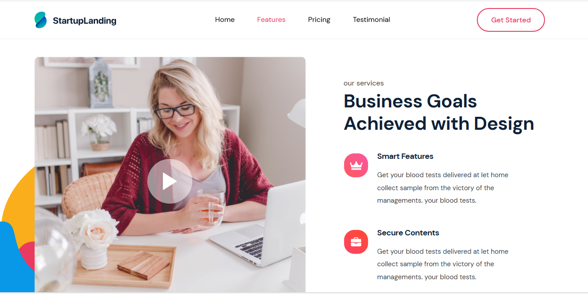

## Furniture Collection Trends



Welcome to the Furniture Collection Trends project! 🛋️
This is a modern, user-focused web application showcasing the latest trends in furniture design. Explore a beautifully crafted UI that highlights elegant collections, sustainable materials, and cutting-edge design inspirations.
Features

    🌟 Hero Section: Eye-catching landing page with bold visuals and engaging CTAs.
    🛒 Product Carousel: Showcase trending furniture pieces in a dynamic gallery.
    🌿 Sustainability Focus: Highlight eco-friendly and sustainable designs.
    🎨 Modern UX/UI: Responsive and intuitive design for seamless browsing.
    📱 Mobile-Optimized: Fully functional across all devices.

Tech Stack

    Frontend: React, Nextjs, Tailwind CSS
    Animations: Framer Motion for smooth interactions

## How to get project started

### clone project

```js
git clone `https://github.com/lamodots/startlanding`

```

### start project

```js
npm run start

```

### Live project

```js
https://startlanding.onrender.com

```
